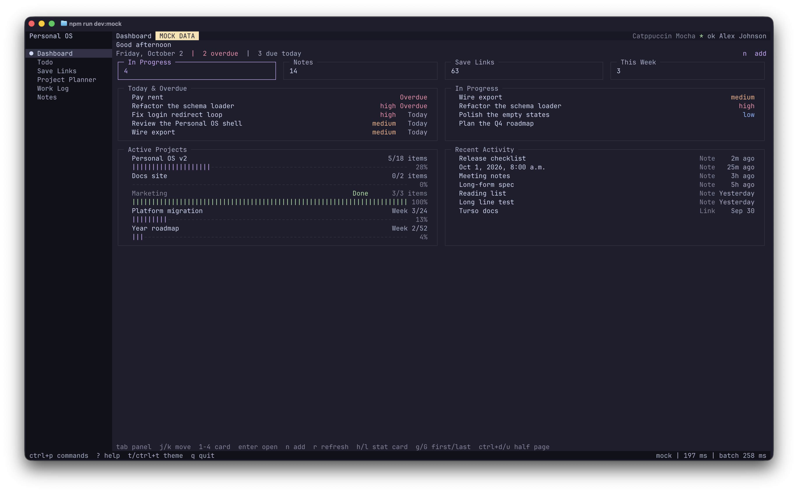
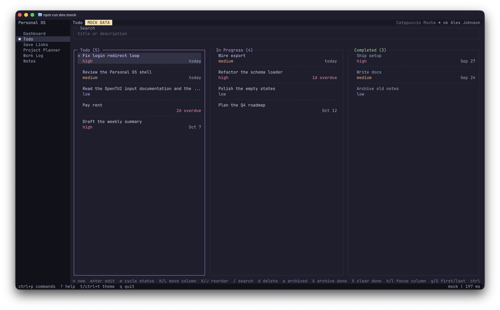
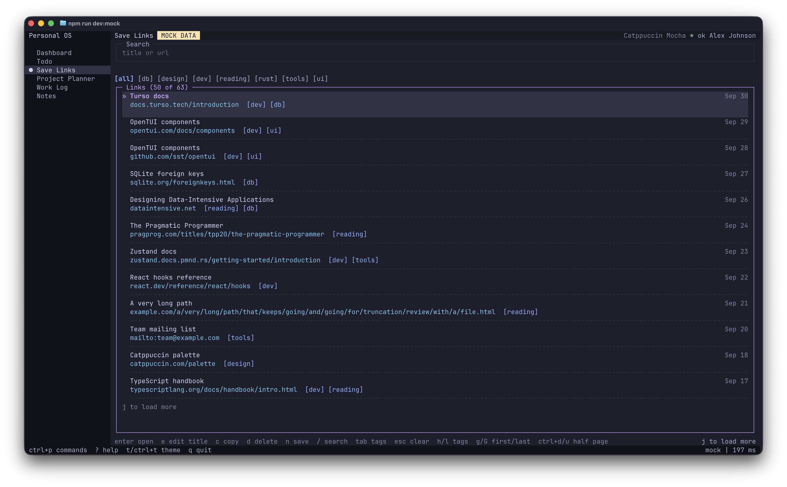
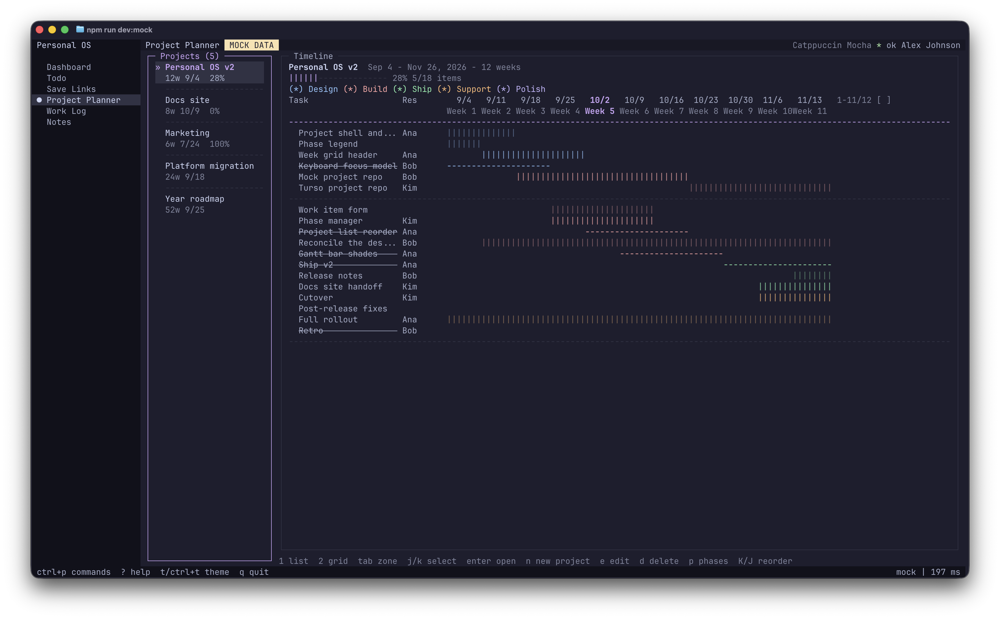
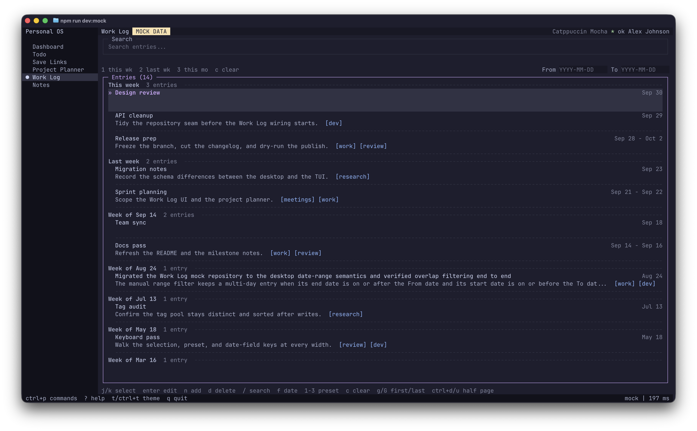
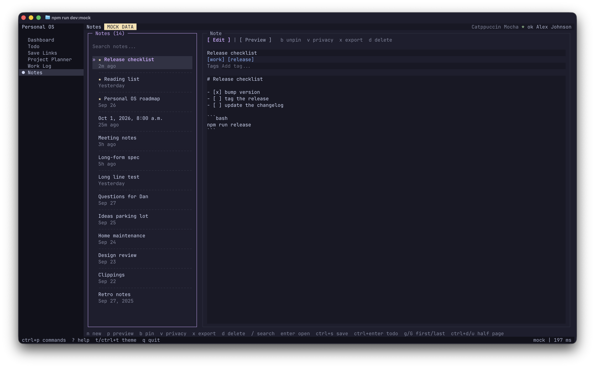
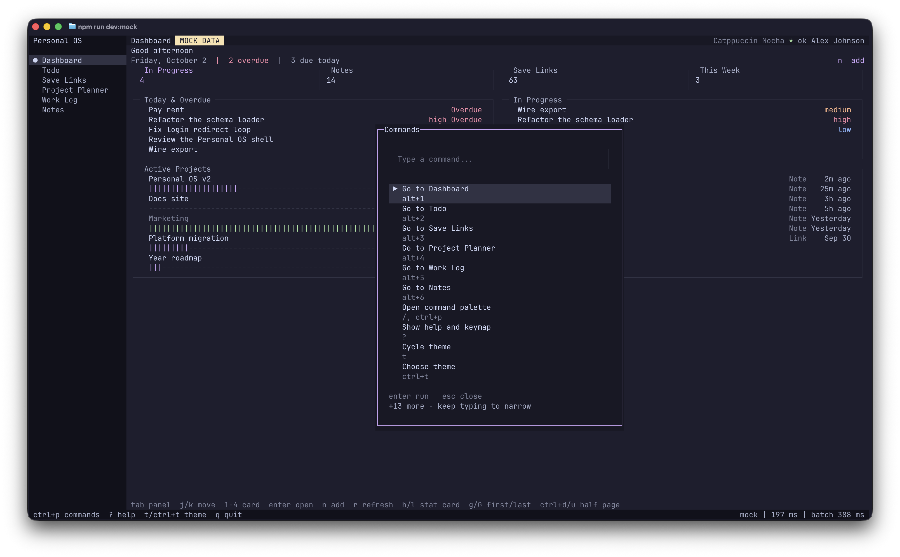

# Personal OS TUI

The terminal version of [Personal OS](https://github.com/im4aLL/personal-os), built on OpenTUI + React. It covers Dashboard, Todo, Save Links, Project Planner, Work Log, and Notes.

It talks directly to your Turso libSQL database, which is the single source of truth: a TUI session and the desktop app pointed at the same database see the same rows.

## Requirements

- Node.js >= 26.4.0
- macOS, Linux, or Windows
- A Turso database (URL + auth token)

## Install

```sh
npm install -g @im4all/personal-os-tui
pos
```

## Connect

On first run, `pos` opens Setup. Enter your Turso database URL and auth token, then finish the short onboarding. Setup stays reachable later from the command palette to edit credentials or profile.

Credentials can also be supplied without persisting them:

```sh
POS_TURSO_URL="libsql://..." POS_TURSO_TOKEN="..." pos
```

Config lives in `~/.config/personal-os-tui` on macOS/Linux and `%APPDATA%\personal-os-tui` on Windows. Override it with `POS_CONFIG_DIR`.

## Keymap

Press `?` in the app for the full keymap generated from the live bindings. Global keys:

| Key | Action |
| --- | --- |
| `alt+1` .. `alt+6` | Jump to a screen (Dashboard, Todo, Save Links, Project Planner, Work Log, Notes) |
| `/` or `ctrl+p` | Command palette |
| `?` | Help and keymap |
| `t` | Cycle theme |
| `ctrl+t` | Theme picker |
| `ctrl+r` | Refresh the current screen |
| `ctrl+\` | Toggle the sidebar |
| `q` / `:q` | Quit while browsing |
| `ctrl+q` | Quit from anywhere |
| `ctrl+c` | Copy selection, or quit while browsing |
| `esc` | Close the open dialog or leave a focused editor |

Per-screen keys (the status line shows the active set):

| Screen | Keys |
| --- | --- |
| Dashboard | `tab` panel, `j/k` move, `h/l` stat card, `g/G` first or last, `ctrl+d/u` half page, `1-4` card, `enter` open, `n` add, `r` refresh |
| Todo | `n` new, `enter` edit, `m` cycle status, `h/l` focus column, `H/L` move column, `K/J` reorder, `g/G` first or last, `ctrl+d/u` half page, `/` search, `d` delete, `a` archived, `A` archive done, `X` clear done |
| Save Links | `enter` open, `e` edit title, `c` copy, `d` delete, `n` save, `/` search, `tab` tags, `h/l` tags, `g/G` first or last, `ctrl+d/u` half page, `esc` clear |
| Project Planner | `1/2` list or grid, `tab` zone, `h/l` zone, `j/k` select, `g/G` first or last, `ctrl+d/u` half page, `enter` open or edit, `n` new, `e` edit, `d` delete, `p` phases, `K/J` reorder, `s` separator, `o` jira, `c` comment, `[` `]` window |
| Work Log | `j/k` select, `g/G` first or last, `ctrl+d/u` half page, `enter` edit, `n` add, `d` delete, `/` search, `f` date, `1-3` preset, `c` clear |
| Notes | `n` new, `p` preview, `b` pin, `v` privacy, `x` export, `d` delete, `/` search, `enter` open, `g/G` first or last, `ctrl+d/u` half page, `ctrl+s` save, `ctrl+enter` todo |

All six browsing screens share a vim-style motion set (`j`/`k`, `g`/`G`, `ctrl+d`/`ctrl+u`), and arrow keys mirror `h/j/k/l`. Mouse is optional: click to select, double-click to open or edit, scroll the wheel; run with `POS_NO_MOUSE=1` for keyboard-only.

### Custom keys

Registry key bindings can be overridden with a `keymap.json` next to `config.json`:

```json
{
  "version": 1,
  "keys": {
    "nav.todo": [{ "name": "t", "meta": true }],
    "global.theme": [{ "name": "t", "shift": true }]
  }
}
```

Naming a command replaces its entire binding list; every unlisted command keeps its defaults. Malformed or colliding entries are skipped and reported by `pos doctor`, never fatal.

## Commands

| Command | Purpose |
| --- | --- |
| `pos` | Launch the app |
| `pos doctor` | Diagnose Node, FFI, config, and repo mode |
| `pos reset` | Move the config aside so the next run shows Setup |
| `pos --mock` | Use in-memory mock data (development builds only) |

## Environment variables

| Variable | Purpose |
| --- | --- |
| `POS_TURSO_URL` / `POS_TURSO_TOKEN` | Credential overrides, never persisted |
| `POS_CONFIG_DIR` | Override the config directory |
| `POS_TZ` | Override the calendar zone for "today", weeks, and dates (e.g. `Europe/Berlin`) |
| `POS_LOCALE` | Override the display locale (e.g. `de-DE`) |
| `POS_NO_MOUSE` | Set to `1` for keyboard-only reachability |

Timestamps are always stored as UTC; `POS_TZ` and `POS_LOCALE` only affect how dates are derived and rendered. `pos doctor` reports both and warns when a value is invalid.

## Terminal support

Tested on Ghostty (including inside the Herdr CLI), iTerm2, Terminal.app, Alacritty, Kitty, WezTerm, tmux, and GNU Screen on macOS/Linux, plus Windows Terminal (PowerShell and Git Bash). 256-color-only terminals degrade to the nearest ANSI color. The terminal is restored on normal quit, `Ctrl+Q`, signals, and crashes.

## Screenshots

### Dashboard



### Todo



### Save Links



### Project Planner



### Work Log



### Notes



### Command palette


